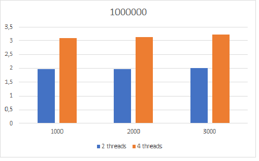
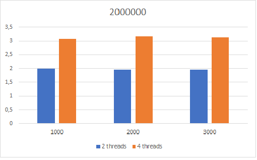
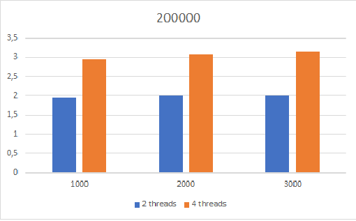
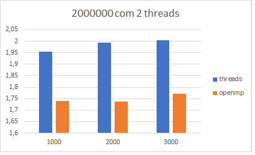
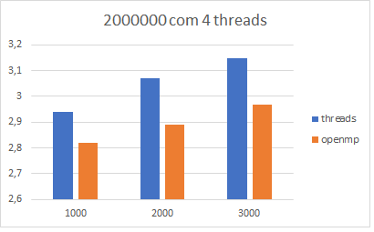
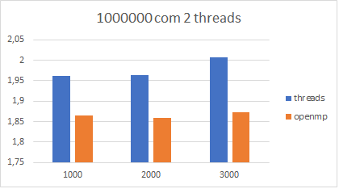
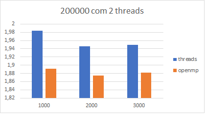
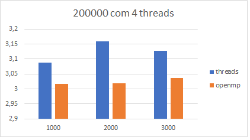

## Arquivo de entrega do trabalho 2

Nome: Lana Bertoldo Rossato  
Disciplina: Programação Paralela

### Pthreads

1. Explique como se encontram implementadas as 4 etapas de projeto: particionamento, comunicação, aglomeração, mapeamento (use trechos de código para ilustrar a explicação).
#### Particionamento 
É a divisão do problema, identificando o máximo de oportunidades de paralelismo. No exemplo dado, vemos os vetores sendo alocados com a função **malloc** e preenchidos com a função **fill**.
```
dotdata.a = (double *) malloc(wsize*nthreads*sizeof(double));
fill(dotdata.a, wsize*nthreads, 0.01);
dotdata.b = (double *) malloc(wsize*nthreads*sizeof(double));
fill(dotdata.b, wsize*nthreads, 1.0);
```
Quando as threads são criadas, a função **dotprod_worker** é chamada, divindo o trabalho com as variáveis **start** e **end**, como mostrado abaixo.
```
int i, k;
long offset = (long) arg;
double *a = dotdata.a;
double *b = dotdata.b;     
int wsize = dotdata.wsize;
int start = offset*wsize;
int end = start + wsize;
double mysum;
```
#### Comunicação
É onde as threads se comunicam, e pode ser vista no código abaixo. O mutex garante a exclusividade da thread enquanto a soma que ela executou é incrementada na variável.
```
pthread_mutex_lock (&mutexsum);
dotdata.c += mysum;
pthread_mutex_unlock (&mutexsum);
```
#### Aglomeração
Tem como objetivo diminuir as comunicações. No código, é feita a soma das multiplicações afim de obter uma soma parcial.
```
for (k = 0; k < dotdata.repeat; k++) {
   mysum = 0.0;
   for (i = start; i < end ; i++)  {
      mysum += (a[i] * b[i]);
   }
}
```
#### Mapeamento
Onde o balanceamento é feito. No código, é de forma estática, feita pela função **doprod_threads** e ao criar, chama a função **dotprod_worker**.
```
for (i = 0; i < nthreads; i++) {
   pthread_create(&threads[i], &attr, dotprod_worker, (void *) i);
}
```

2. Considerando o tempo (em microssegundos) mostrado na saída do programa, qual foi a aceleração (speedup) com o uso de threads?
```
$ ./pthreads_dotprod 1 1000000 2000
10000.000000
1 thread(s), 5497019 usec
$ ./pthreads_dotprod 2 500000 2000
10000.000000
2 thread(s), 2907005 usec
```
Gerando um speedup de 1.890956.

3. A aceleração se sustenta para outros tamanhos de vetores, números de threads e repetições? Para responder a essa questão, você terá que realizar diversas execuções, variando o tamanho do problema (tamanho dos vetores e número de repetições) e o número de threads (1, 2, 4, 8..., dependendo do número de núcleos). Cada caso deve ser executado várias vezes, para depois calcular-se um tempo de processamento médio para cada caso. Atenção aos fatores que podem interferir na confiabilidade da medição: uso compartilhado do computador, tempos muito pequenos, etc.

A tabela com a média, máximo e mínimo estão no arquivo [tabelaminmax.png](pthreads_dotprod/tabelaminmax.PNG). Sendo assim, as acelerações são as das tabelas abaixo.

Vetor de tamanho 1000000:

Repetições | Aceleração com 2 threads | Aceleração com 4 threads
:---------:|:------------------------:|:------------------------:
 1000      |   	1,961601253	        |      3,090268424
 2000	     |      1,963328724         |   	3,126926788
 3000      |     	2,007918135	        |      3,242751746

Vetor de tamanho 200000:

Repetições | Aceleração com 2 threads | Aceleração com 4 threads
:---------:|:------------------------:|:------------------------:
 1000      |    	1,955362062         |     2,941302023
 2000	     |      1,993677599         |  	  3,069364665
 3000	     |      2,003190535         |  	  3,149469522

Vetor com tamanho 2000000:  

Repetições | Aceleração com 2 threads | Aceleração com 4 threads
:---------:|:------------------------:|:------------------------:
 1000	     |      1,984377142	        |     3,08909785
 2000	     |      1,945395109	        |     3,160316252
 3000	     |      1,949555976	        |     3,128649539

Com base nas tabelas, é possível ver que a aceleração aumenta conforme o número de threads, mas a diferença não é muito grande. Porém , quanto maior é o vetor, menor é a aceleração, não importando o número de threads. 

4. Elabore um gráfico/tabela de aceleração a partir dos dados obtidos no exercício anterior.






5. Explique as diferenças entre pthreads_dotprod.c e pthreads_dotprod2.c. Com as linhas removidas, o programa está correto?

A diferença está no uso do mutex, que garante a exclusão mutua, e é usado em pthreads_dotprod.c, mas não é usado em pthreads_dotprod2.c. Apesar de em alguns testes dar o mesmo resultado, o programa não está certo, pois duas threads podem ler/escrever a variável ao mesmo tempo, gerando inconsistência.

### OpenMP
1. Implemente um programa equivalente a pthreads_dotprod.c usando OpenMP.

Código completo em [ompsimple.c](openmp/ompsimple.c)

2. Avalie o desempenho do programa em OpenMP, usando os mesmos dados/argumentos do programa com threads POSIX.

Vetor de tamanho 1000000:

Repetições | Aceleração com 2 threads | Aceleração com 4 threads
:---------:|:------------------------:|:------------------------:
 1000      |   	1,864900613	        |       3,283996538
 2000	     |      1,859747117	        |       3,293511366
 3000      |     	1,873041226	        |       3,291534563

Vetor de tamanho 200000:

Repetições | Aceleração com 2 threads | Aceleração com 4 threads
:---------:|:------------------------:|:------------------------:
 1000      |      1,739789403	        |       2,818997858
 2000	     |      1,738396228	        |       2,891903933
 3000	     |      1,770672136	        |       2,967619283

Vetor com tamanho 2000000:  

Repetições | Aceleração com 2 threads | Aceleração com 4 threads
:---------:|:------------------------:|:------------------------:
 1000	     |      1,890738521	        |       3,015891871
 2000	     |      1,875073789	        |       3,018205757
 3000	     |      1,882233108	        |       3,036273273








No geral, os valores de aceleração da execução com OpenMP foram melhores do que com Pthreads, ficando quase sempre na mesma proporção.

### Referências
Projeto de programas paralelos. https://github.com/AndreaInfUFSM/elc139-2019a/tree/master/slides  
Introdução ao OpenMP. https://www.dcc.fc.up.pt/~fds/aulas/PPD/0708/intro_openmp-1x2.pdf
